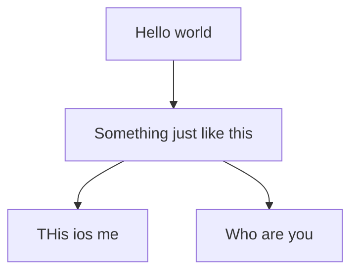
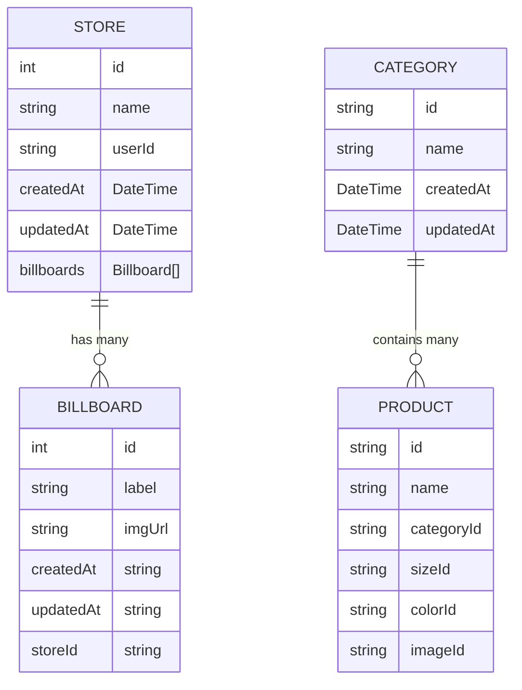

# Solar Ecommerce App

### Front-end Architecture 

Future features

- Send email weekly, daily, monthly about the number of orders, growth, revenue changes and shit like that

- Machine learning to predict monthly growth (weekly task)

### Database schema

